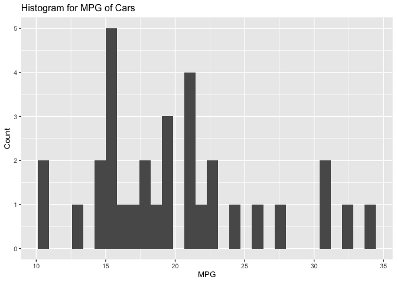
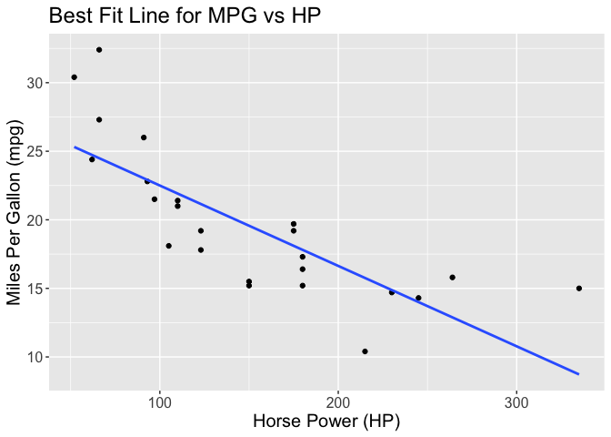

<!-- README.md is generated from README.Rmd. Please edit that file -->

# ln.knn.regression

<!-- badges: start -->

[](https://codecov.io/gh/DSCI-310/dsci-310-group-09-pkg)
<!-- badges: end -->

The goal of `ln.knn.regression` is to assist in creating a regression
analysis project from start to finish. It includes **R** functions that
help to explore, summarize and visualize the data. It also includes
functions that directly build and visualize linear and k-nn models.
Additionally, it contains functions that can test the model’s error and
accuracy.

`ln.knn.regression` is similar to
[`tidymodels`](https://www.tidymodels.org/packages/) which is a
collection of packages for modeling and machine learning using
[`tidyverse`](https://www.tidyverse.org/) principles.
`ln.knn.regression` imports many of the same packages that `tidymodels`
and `tidyverse` use, such as [`dplyr`](https://dplyr.tidyverse.org/),
[`ggplot2`](https://ggplot2.tidyverse.org/),
[`parsnip`](https://parsnip.tidymodels.org/),
[`rsample`](https://rsample.tidymodels.org/) and more. Like
`tidymodels`, `ln.knn.regression` contains functions for building models
and performing data analysis. However, `ln.knn.regression` is a smaller
and more simple package that is used specifically for regression
modeling and analysis.

## Installation

You can install the development version of `ln.knn.regression` from
[GitHub](https://github.com/) with:

``` r
# install.packages("devtools")
devtools::install_github("DSCI-310/dsci-310-group-09-pkg")
```

## Functions

- `bar_graph()`
- `hist_plot()`
- `knn_model()`
- `linearmodel()`
- `model_rmspe()`
- `scatter_plot()`
- `summarize_column()`

## Example

Here is a basic example which shows you how to explore the data and
build a linear regression model.

#### 1. EDA

``` r
library(ln.knn.regression)

summarize_column(mtcars, mtcars$mpg)
#>       mean  med       sd
#> 1 20.09062 19.2 6.026948

hist_plot(mtcars, mpg, "MPG", "Count", "Histogram for MPG of Cars", 10)
#> `stat_bin()` using `bins = 30`. Pick better value with `binwidth`.
```



#### 2. Model Building

``` r
mtcars_model <- linearmodel(recipes::recipe(mpg ~ hp, mtcars_training), mtcars_training)
mtcars_model
#> ══ Workflow [trained] ══════════════════════════════════════════════════════════
#> Preprocessor: Recipe
#> Model: linear_reg()
#> 
#> ── Preprocessor ────────────────────────────────────────────────────────────────
#> 0 Recipe Steps
#> 
#> ── Model ───────────────────────────────────────────────────────────────────────
#> 
#> Call:
#> stats::lm(formula = ..y ~ ., data = data)
#> 
#> Coefficients:
#> (Intercept)           hp  
#>    28.36292     -0.05863
```

#### 3. Visualizations

``` r
scatter_plot(mtcars_training, 
             hp, 
             mpg, 
             "Horse Power (HP)", 
             "Miles Per Gallon (mpg)",
             "Best Fit Line for MPG vs HP", 
             15,
             "lm") 
#> `geom_smooth()` using formula = 'y ~ x'
```



#### 4. Finding model’s accuracy

``` r
mtcars_rmspe <- model_rmspe(mtcars_model, mtcars_testing, "mpg")
mtcars_rmspe
#> [1] 4.99694
```

This tells us that the model has a prediction error of around 5 miles
per gallon when tested on data it has not seen before.

## Further Resources

For a detailed tutorial on how to use each of the functions in
`ln.knn.regression`, refer to our
[Vignette](https://github.com/DSCI-310/dsci-310-group-09-pkg/blob/main/vignettes/ln_knn_regression-vignette.Rmd).

To view an example of when this package was used for an analysis, please
view this
[repository](https://github.com/jennalenoble/dsci-310-group-09)

## Contributing

We appreciate contributions to the `ln.knn.regression` package. Please
refer to our [Contributing
document](https://github.com/DSCI-310/dsci-310-group-09-pkg/blob/main/CONTRIBUTING.md)
and [Code of
Conduct](https://github.com/DSCI-310/dsci-310-group-09-pkg/blob/main/CODE_OF_CONDUCT.md)
for more information.

## License

The software provided in this project is offered under the [MIT open
source license](https://opensource.org/license/mit/). Refer to the
[license
file](https://github.com/DSCI-310/dsci-310-group-09-pkg/blob/main/LICENSE.md)
for more information.
